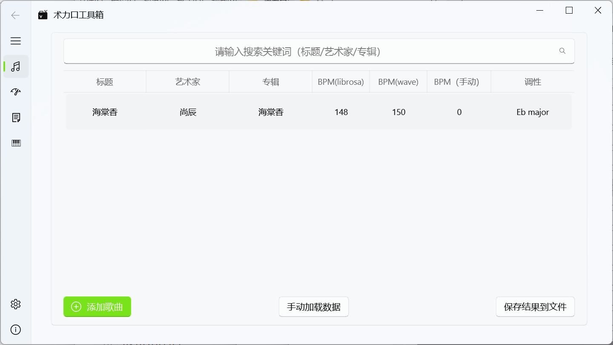
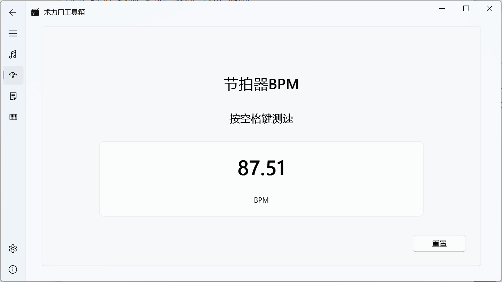
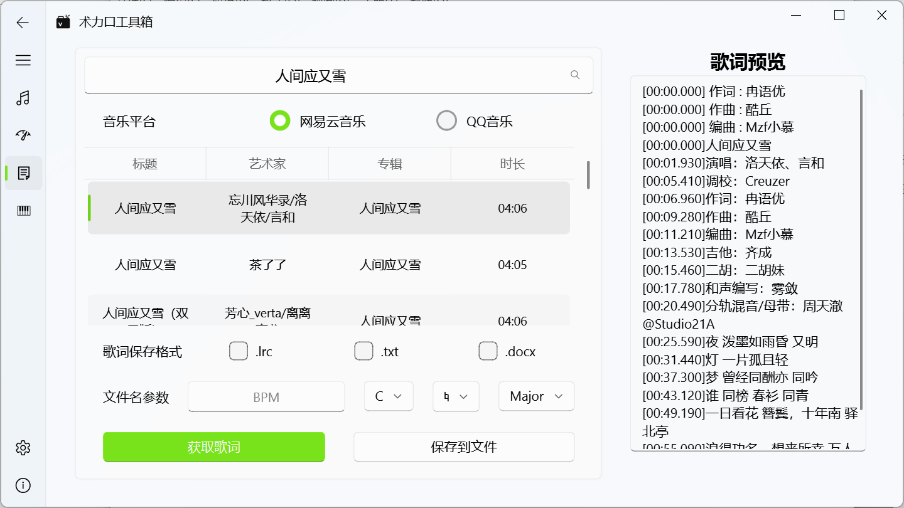
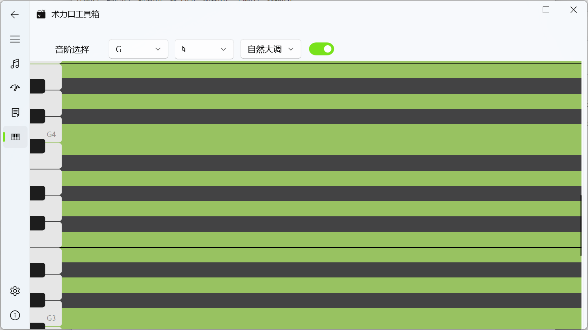
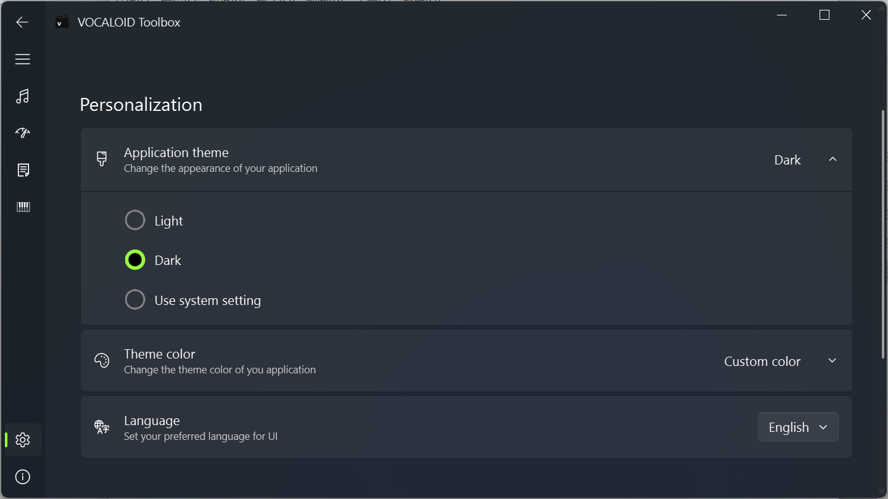

# 术力口工具箱

这里也记录一下嘿嘿


## 功能

### 自动检测曲速、调性

选择左下角`添加歌曲`按钮（或者直接将歌曲拖入窗口中），选择想要检测的歌曲即可。结果将会以5min（默认）的间隔自动保存到`data/bpm_key.csv`中，也可以手动点击右下角`保存结果到文件`按钮。



每一行的`BPM（手动）`一列可以编辑。

检测数据太多时，可以在上方搜索框进行筛选。

自动检测结果仅供参考~~~准确率没有具体测过（~~

### 手动检测曲速



### 获取歌词

首先选择音乐平台，在上方搜索歌曲后选择想要获取歌词的歌曲，然后点击获取歌词。



获取歌词后，可以将歌词保存到文件（需要选择格式以及输入文件名参数）。

### 音阶查看

选择不同音阶，打开按钮即可查看相应音阶。



点击钢琴按键（E2~F#7）可以播放声音。（音频来自ACE Studio）

### 设置

在个性化一栏可以切换深浅色主题以及显示语言（中、英，需重启）。



## requirements

这些通过一般pip安装即可。

```
librosa==0.9.2
mutagen~=1.47.0
numpy~=1.23.3
matplotlib~=3.7.1
scipy~=1.10.1
filetype~=1.2.0
pydub~=0.25.1
pandas
PyQt5
pyinstaller
```

这些特殊一点，使用以下命令。

```shell
pip install git+https://github.com/luren-dc/PyQQMusicApi.git
pip install git+https://github.com/CPJKU/madmom
pip install "PyQt-Fluent-Widgets[full]" -i https://pypi.org/simple/
```

可能还有库漏了写（

## 打包

此处使用以auto-py-to-exe为例。（因为真的懒得输命令（

1. 在终端输入：

```shell
auto-py-to-exe
```

2. 选择脚本位置（main.py）

3. 单文件or单目录看个人喜好

4. --upx-dir：选择自己upx的目录即可

5. --clean：开启

6. --hidden-import：

```
madmom.ml.nn.layers
```

7. --additional-hooks-dir：选择项目下`extra-hooks`目录

8. 然后启动即可，输出结果在`output`目录

